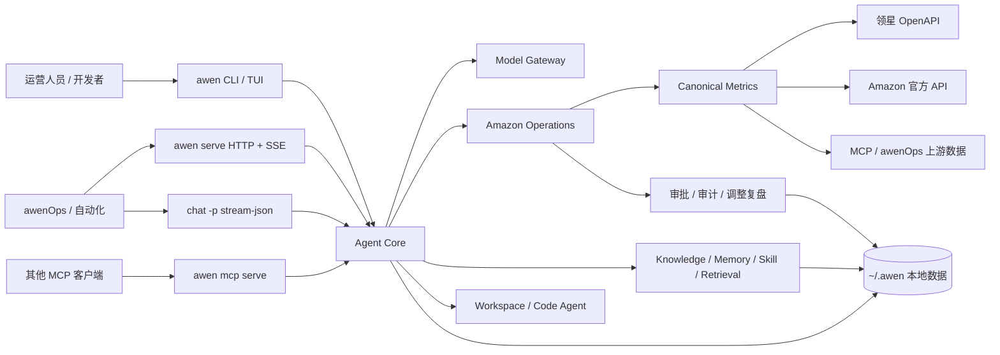

# awen Agent · 自托管的 Amazon 运营智能体

[](https://github.com/zheng-zhengwen/awen-agent/releases/latest)
[](https://github.com/zheng-zhengwen/awen-agent/actions/workflows/ci.yml)
[](https://github.com/zheng-zhengwen/awen-agent/stargazers)
[](https://www.python.org/)
[](#环境要求)
[](LICENSE)

**awen Agent** 是一个面向 Amazon 运营场景的开源、自托管智能体。它把广告、搜索词、Listing、
库存、利润和店铺数据转换成可解释的诊断、候选动作与效果复盘，并用确定性规则、人工审批、写入护栏、
审计和回滚保护真实业务。

它既可以作为终端工具独立运行，也可以通过 HTTP、结构化事件流和只读 MCP 被
[awenOps](https://github.com/zheng-zhengwen/wen-System) 或其他系统调用。项目使用本地 SQLite、JSON、
JSONL 和 Markdown 保存状态，**不需要部署外部数据库服务，也不要求 Node.js**。

> 当前定位：Beta。默认只读、默认 dry-run、默认不修改广告。模型输出负责解释与复核，金额、权限、
> 幅度、保护词和状态转换等硬约束由确定性代码执行。

## 目录

- [项目定位](#项目定位)
- [整体架构](#整体架构)
- [能力与依赖](#能力与依赖)
- [环境要求](#环境要求)
- [快速安装](#快速安装)
- [首次配置](#首次配置)
- [四种运行方式](#四种运行方式)
- [Amazon 数据源](#amazon-数据源)
- [广告运营闭环](#广告运营闭环)
- [广告调整复盘中心](#广告调整复盘中心)
- [知识记忆与 Skill](#知识记忆与-skill)
- [代码工程能力](#代码工程能力)
- [飞书与计划任务](#飞书与计划任务)
- [awenOps 接入](#awenops-接入)
- [数据目录与安全](#数据目录与安全)
- [部署与运维](#部署与运维)
- [开发与验证](#开发与验证)
- [当前边界](#当前边界)
- [文档与许可证](#文档与许可证)

## 项目定位

awen Agent 同时承担两个角色：

1. **独立的 Amazon 运营 CLI**：运营人员可以在终端里对话、巡检、分析报表、管理知识和审批动作。
2. **awenOps 的本地智能底座**：工作台通过 HTTP 或结构化子进程协议驱动 Agent，不需要解析面向人的
   彩色终端输出，也不依赖 Hermes、GBrain 或 Ollama 才能完成基础流程。

项目中的几个名称分别代表：

| 名称 | 含义 |
|---|---|
| `awen-agent` | Python 发行包名 |
| `awen_agent` | Python 模块名 |
| `awen` | 命令行入口 |
| `~/.awen/` | 默认用户数据目录，可用 `AWEN_HOME` 覆盖 |
| `awenOps` | 独立的业务工作台和本项目的主要消费方之一 |

### 设计原则

- **证据驱动**：先保存来源、时间窗、分子分母和数据完整度，再形成结论。
- **规则优先**：广告候选由确定性规则生成，LLM 负责语义分类、归因辅助、风险复核和说明。
- **默认只读**：巡检、对话、HTTP Chat 和反向 MCP 默认不执行真实写入。
- **审批制写入**：真实广告修改必须经过写开关、权限、人工审批、幅度限制和写前快照。
- **业务事实不可变**：动作、审批、证据和复盘分别保存；补数产生新 revision，不覆盖历史。
- **能力缺失可诊断**：缺模型、凭据、报表或映射时返回明确错误或 `data_gap`，不伪造成功。
- **本地优先**：配置、密钥、记忆、知识、审计和业务账本默认都留在运行机器上。

### 它不是什么

- 不是无人监管、自动改钱的广告机器人。
- 不是财务对账或结算系统。
- 不会把一次广告调整与后续变化直接宣称为因果关系。
- 不会在不同来源之间做高风险的模糊动作匹配或模糊回滚。
- 不包含 awenOps 的前端页面；本仓库提供 CLI、Agent Runtime、HTTP API 和 MCP 能力。

## 整体架构



主要分层：

| 层 | 责任 | 典型模块 |
|---|---|---|
| Agent Core | 对话循环、任务状态、路由、工具预算、中断、恢复、自验证 | `agent_loop.py`、`routing.py`、`goal_mode.py` |
| Model Gateway | 多 provider、API Key/OAuth、流式输出、重试和 fallback | `models.py`、`providers/`、`oauth_auth.py` |
| Amazon Operations | 指标、巡检、优化、写入、店铺健康、调整复盘 | `metrics.py`、`store_health.py`、`lingxing_*`、`adjustment_*` |
| Knowledge Engine | 知识治理、长期记忆、Skill、本地混合检索 | `knowledge*.py`、`memory*.py`、`skills.py`、`retrieval*.py` |
| Engineering Tools | 项目索引、代码导航、补丁、测试、审查、任务恢复 | `workspace.py`、`code_agent.py`、`patcher.py` |
| Integration Layer | CLI、HTTP/SSE、stream-json、MCP、飞书 | `cli.py`、`service.py`、`mcp_server.py`、`feishu_relay/` |

## 能力与依赖

| 能力 | 当前状态 | 运行条件或边界 |
|---|---|---|
| 终端对话 Agent | 内置 | 需要可用主脑模型；规则巡检可用 `--no-llm` 跳过模型 |
| 多模型与 OAuth | 内置 | API 型 provider 需要 Key；登录型 provider 需要完成本地授权 |
| CSV 广告巡检 | 内置 | 不需要卖家账户凭据 |
| 领星广告读取 | 内置 | 需要领星 OpenAPI `appId` / `appSecret` |
| 领星广告写入 | 条件开启 | 默认关闭；只支持审批后的受控操作 |
| Amazon 官方 API | 内置适配层 | 需要 LWA、Ads profile 和 marketplace 配置 |
| 通用 MCP 数据源 | 内置 | 需要用户配置可信的 HTTP/SSE/stdio MCP Server |
| L1/L2/L3 店铺巡检 | 内置 | 实际规则取决于店铺拥有的数据源 |
| 广告调整与效果复盘 | 内置 | 动作账本可独立运行；效果层缺数据时显示 `data_gap` |
| 飞书通知与按钮审批 | 可选 | 需要 `feishu` extra、应用凭据、目标会话和审批白名单 |
| 本地语义记忆 | 内置 | 随包携带 ONNX int8 模型，CPU 可运行，不需要 torch |
| 更强本地 embedding | 可选 | `sentence-transformers`，内存和磁盘占用更高 |
| 代码 Agent | 内置 | 文件写入、命令执行仍受本地策略和人工审批约束 |
| 反向 MCP Server | 内置且只读 | 不暴露文件写入、命令执行或广告写入工具 |

## 环境要求

- Python `3.9+`。
- Windows、macOS 或 Linux。
- 从源码安装需要 Git。
- 在线模型、领星、Amazon 官方 API 和远程 MCP 需要相应网络与账户权限。
- 项目本身不依赖外部数据库服务；本地持久化使用 SQLite、JSON、JSONL 和 Markdown。
- OCR 在精简 Linux 镜像中可能需要系统库 `libGL.so.1`；缺少时会降级，不阻断其他能力。

CI 当前在以下组合运行全量测试：

- Ubuntu、macOS、Windows。
- Python 3.9、3.11、3.12。

## 快速安装

项目通过 **GitHub Release 资产**分发，不发布 PyPI。安装脚本优先选择最新 Release wheel，无法取得
Release 时回退到 Git 源码安装。

### Linux 和 macOS

```bash
curl -fsSL https://raw.githubusercontent.com/zheng-zhengwen/awen-agent/main/scripts/install.sh | bash
awen self doctor
awen onboard
```

### Windows PowerShell

```powershell
iwr https://raw.githubusercontent.com/zheng-zhengwen/awen-agent/main/scripts/install.ps1 -UseBasicParsing | iex
awen self doctor
awen onboard
```

安装脚本使用 pipx 隔离依赖并把 `awen` 启动器加入用户 PATH。Windows 安装完成后如果当前窗口仍提示
找不到 `awen`，请重新打开 PowerShell；也可以直接运行 pipx 提示的启动器路径。

### 从源码安装供日常使用

```bash
git clone https://github.com/zheng-zhengwen/awen-agent.git
cd awen-agent
pipx install .
awen self doctor
```

### 开发模式

Linux / macOS：

```bash
git clone https://github.com/zheng-zhengwen/awen-agent.git
cd awen-agent
python3 -m venv .venv
. .venv/bin/activate
python -m pip install -e ".[dev,anthropic]"
python -m pytest -m "not slow"
```

Windows PowerShell：

```powershell
git clone https://github.com/zheng-zhengwen/awen-agent.git
Set-Location awen-agent
python -m venv .venv
.\.venv\Scripts\python.exe -m pip install -e ".[dev,anthropic]"
.\.venv\Scripts\awen.exe self doctor
```

可选依赖：

```bash
# 飞书长连接、消息和按钮审批
python -m pip install -e ".[feishu]"

# 完整 sentence-transformers 本地 embedding
python -m pip install -e ".[semantic]"
```

需要离线或内网部署时，不要逐台手工缓存依赖。仓库提供 wheelhouse 离线包和单文件构建流程，详见
[部署指南](docs/部署指南.md#离线内网部署推荐)。

## 首次配置

### 1. 检查安装

```bash
awen --version
awen self doctor
```

`self doctor` 检查 Python、安装方式、PATH、数据目录和核心依赖，不会验证真实模型调用。

### 2. 完成引导

```bash
awen onboard
```

也可以分别配置：

```bash
awen config
awen model
awen retrieval sync
```

引导会完成：

- 选择主脑 provider 和模型。
- 保存 API Key 或引导 OAuth 登录。
- 设置默认站点和目标 ACoS。
- 可选配置领星 OpenAPI。
- 可选生成本地 `AGENTS.md` 运营规则。

### 3. 检查模型

```bash
awen model providers
awen model doctor
awen model auth
```

支持的模型形态包括：

- OpenAI 兼容端点：DeepSeek、通义、Kimi、Z.AI/GLM、豆包、MiniMax、OpenRouter、Nous、xAI、
  Ollama 和自定义网关。
- 原生或专用适配：Claude API、Gemini API、AWS Bedrock Converse。
- 登录型 provider：OpenAI Codex、Gemini Code Assist、GitHub Copilot、Qwen OAuth 等。

切换模型示例：

```bash
awen model deepseek:deepseek-chat
awen model openrouter:anthropic/claude-sonnet-4.6
awen model ollama:qwen3-coder
```

OAuth/Bearer 状态与真实探测分开：保存凭据不代表模型一定可用，只有 `--probe` 才会发起最小真实请求
验证权限、模型和配额。探测输出不会打印 Token。

```bash
awen model auth openai-codex --device-code
awen model auth openai-codex --probe
awen model auth google-gemini-cli --login
awen model auth copilot --exchange
awen model auth copilot --probe
```

模型 API Key 存在 `~/.awen/.env`，OAuth/Bearer 状态存在 `~/.awen/auth.json`。已有环境变量的值优先，
本地文件不会覆盖进程环境。

## 四种运行方式

### 1. 终端交互

```bash
awen
# 或
awen chat
```

常用方式：

```bash
awen --continue                 # 续接最近会话
awen chat --resume <session-id> # 续接指定会话
awen chat --no-memory           # 本轮不写入记忆，但仍会读取已有记忆
awen chat --raw                 # 查看原始流式文本
```

终端支持 Markdown 渲染、带框输入、工具进度、Todo/Plan、模型和上下文状态。`Ctrl+C` 中断当前轮，不会
删除会话。常用斜杠命令包括：

```text
/help  /model  /think  /critique  /plan  /approve
/memory  /reflect  /skill  /workspace  /patch  /gitops
/tools  /mcp  /compact  /rewind  /clear  /exit
```

设置 `AWEN_BOXED_INPUT=0` 可切换成轻量单行输入；设置 `NO_COLOR=1` 可关闭颜色。

### 2. 一次性和结构化事件流

把 Agent 当作脚本 runner：

```bash
awen chat -p "分析 B0XXXX 最近 30 天广告并给方案"
awen chat -p "继续上一轮分析" --resume <session-id>
```

供 awenOps 或其他程序消费 NDJSON：

```bash
awen chat -p "分析 B0XXXX 广告并给方案" --output-format stream-json
```

事件流包含初始化、Assistant 增量、工具调用结果和最终结果。`--input-format stream-json` 还允许调用方在
任务运行中追加指令、回答选择卡或中止任务。

无人值守审批模式：

```bash
awen chat -p "执行已批准的本地任务" --permission-mode policy
```

- `default`：一次性模式遇到写工具时停止并请求人工处理。
- `policy`：按 `~/.awen/policy.json` 的 allow/deny 判定。
- `approve-all`：显式完全放行，风险最高；仍不会绕过广告领域的确定性硬护栏。

长任务可以绑定任务状态：

```bash
awen task create --title "补齐数据接入" --step "确认契约" --step "实现" --step "验证"
awen chat --task-id <task-id>
awen task resume <task-id>
awen task continue <task-id>
```

### 3. 本地 HTTP 服务

```bash
awen serve --host 127.0.0.1 --port 8765
```

另开一个终端检查：

```bash
curl http://127.0.0.1:8765/health
curl http://127.0.0.1:8765/v1/system/bootstrap
curl http://127.0.0.1:8765/v1/manifest
curl http://127.0.0.1:8765/v1/openapi.json
```

localhost 默认不要求 API Token。绑定非 localhost 地址时，必须显式允许远程访问并提供 Token：

```bash
export AWEN_API_TOKEN="<由你的密钥管理系统注入>"
awen serve --host 0.0.0.0 --port 8765 --allow-remote
```

Windows PowerShell：

```powershell
$env:AWEN_API_TOKEN = Read-Host "API Token"
awen serve --host 0.0.0.0 --port 8765 --allow-remote
```

远程请求使用 `Authorization: Bearer ...`。如果不需要跨机器访问，请始终保留默认的
`127.0.0.1` 绑定。

`serve` 默认还会启动两个后台工人：

- 每 5 分钟检查 `schedule.json` 中是否有到期任务。
- 已配置飞书且安装 SDK 时维持飞书长连接。

如果检测到外部 systemd timer 或独立 relay 服务，进程内工人会主动让位，避免重复巡检和重复处理按钮。

### 4. 只读 MCP Server

```bash
awen mcp serve
```

它向其他 MCP 客户端提供知识、检索、Skill、任务、Trace、Workspace、代码上下文和广告调整只读查询，
不暴露文件写入、命令执行或广告真实写入。

获取标准配置：

```bash
awen mcp self-config
```

## Amazon 数据源

业务规则只读取 canonical metric，不直接依赖某一个供应商的原始字段。当前支持四条数据路径：

| 数据源 | 适合场景 | 配置方式 | 主要边界 |
|---|---|---|---|
| CSV / XLSX | 离线试用、人工报表 | 直接传文件 | 只能分析文件中存在的字段和时间窗 |
| 领星 OpenAPI | 店铺巡检、广告读取与受控写入 | `awen lingxing setup` | 需要领星应用权限，部分报表存在 T+1 延迟 |
| Amazon 官方 API | 官方 SP-API / Ads API 数据 | awenOps 的 Amazon 配置页，或本地凭据与 marketplace 设置 | 需要 LWA、profile 与 marketplace 权限 |
| 通用 MCP | Sorftime、自建数据服务等 | `awen mcp add` | 需要配置 dataSource 映射并核实服务器信任边界 |

### 领星

```bash
awen lingxing setup     # 保存 host、appId、appSecret
awen lingxing probe     # 获取令牌并验证店铺接口
awen lingxing sellers   # 查看店铺 SID
awen lingxing cache clear
```

凭据保存在本机，`probe` 才会发起真实验证。广告写入开关与读取凭据是两件事：配置成功后可以只读拉数，
并不会自动开启写广告。

### Amazon 官方 API

推荐通过 awenOps 的 Amazon 配置页写入 LWA 凭据、区域、Seller、marketplace 和 Ads profile。手工部署
时，SP-API 凭据使用 `AMAZON_LWA_CLIENT_ID`、`AMAZON_LWA_CLIENT_SECRET`、
`AMAZON_LWA_REFRESH_TOKEN`；如果 Ads API 使用另一套应用，则另外配置 `AMAZON_ADS_CLIENT_ID`、
`AMAZON_ADS_CLIENT_SECRET`、`AMAZON_ADS_REFRESH_TOKEN`。站点和 profile 映射保存在
`settings.json` 的 `amazon.marketplaces` 中。

```bash
awen amazon status
awen amazon verify
awen amazon profiles
```

`status` 查看本地配置，`verify` 发起真实授权验证，`profiles` 读取广告档案。没有成本、Listing 或某类
报表权限时，依赖这些数据的规则会标记能力缺口，不会把空响应解释成零。

### 通用 MCP

awen 可以作为 MCP 客户端连接 HTTP、SSE 或 stdio Server：

```bash
awen mcp add
awen mcp list
awen mcp tools <server-name>
awen mcp call <server-name> <tool-name> --args '{"asin":"B0..."}'
awen mcp validate <server-name>
awen mcp doctor
```

新建 stdio Server 时默认建议收紧子进程环境。已有旧配置维持原行为，可通过以下命令审计和调整：

```bash
awen mcp doctor
awen mcp env <server-name> --secure
awen mcp env <server-name> --pass GITHUB_TOKEN
awen mcp env <server-name> --set KEY=value
```

只把服务器真正需要的变量加入白名单，不要无条件继承整台机器的全部环境变量。

## 广告运营闭环

### 只读巡检

本地报表：

```bash
awen patrol 搜索词报告.xlsx --asin B0XXXXXXXX --site US --target-acos 0.30
awen diagnose 搜索词报告.csv
```

领星店铺：

```bash
awen patrol --from-lingxing --sid 1863 --days 30
```

通用 MCP：

```bash
awen patrol --from-mcp <server-name> --asin B0XXXXXXXX --days 30
```

规则引擎会输出否词、降低/提高竞价、预算调整、Listing 反馈、观察和人工复核等候选。每条候选包含规则、
指标、理由、置信度和护栏状态。没有模型时可使用 `--no-llm` 只运行确定性规则。

### 店铺健康巡检

| 层 | 数据语义 | 典型延迟 | 代码默认节奏 |
|---|---|---|---|
| L1 | 当前库存、活动、广告组、关键词等快照 | 秒到分钟 | 60 分钟 |
| L2 | 当日累计报表多次采样后的日内变化 | 小时级 | 12 小时 |
| L3 | 完整报表、ASIN 利润和优化器候选 | T+1 | 每日 |

```bash
awen store list
awen store health --sid 1863
awen store health --sid 1863 --layer l2
awen store health --sid 1863 --layer l3 --days 7
awen store health --all-stores
awen store health --sids 1863,1872
awen store health --all-stores --exclude-sids 1870,1871
```

多店模式会逐店隔离失败，未配置广告的店铺自动跳过广告规则；同父体的重复变体问题会合并展示。每条
结果都带来源和数据延迟，数据源失败与“没有发现问题”是不同状态。

### 审批制写入

当前领星受控写入支持：

- 新增否定关键词。
- 调整关键词竞价。
- 调整活动日预算。

真实执行需要同时满足：

1. 候选通过确定性护栏。
2. 人工批准该动作。
3. 领星 operate 总开关仍在有效期。
4. 写前成功取得必要快照。

```bash
# 开启临时写入总闸，默认 120 分钟后自动关闭
awen lingxing operate on
awen lingxing operate status

# 巡检并逐条审批
awen patrol --from-lingxing --sid 1863 --days 30 --execute

# 完成后主动关闭
awen lingxing operate off
```

`--yes` 可以跳过巡检候选的逐条命令行确认，但不会绕过 operate 开关、幅度上限、保护词、冷却期、
写前快照和失败熔断。

异步审批：

```bash
awen approval list
awen approval show <approval-id>
awen approval approve <approval-id> --operator <name>
awen approval execute <approval-id> --operator <name>
awen approval deny <approval-id> --operator <name>
awen approval rollback <approval-id> --operator <name>
```

如果批准时 operate 开关关闭，审批会保留为待执行，而不是丢失批准意愿。重新开启开关后可再次执行。

技术写入审计：

```bash
awen audit list
awen audit rollback <audit-id>
```

回滚只使用本地写入时保存的明确对象和快照。否词回滚采用归档/撤销语义，竞价和预算回到记录的旧值；
系统不会根据相似时间、相似数值或领星历史日志猜测回滚对象。

### 影子模式

在真实写入前，可以只记录候选并用后续数据回测：

```bash
awen shadow on
awen patrol --from-lingxing --sid 1863 --days 30
awen shadow list --sid 1863
awen shadow report --sid 1863 --days 14
awen shadow off
```

影子模式、计划模式和 operate 开关互不等价：

| 机制 | 解决的问题 |
|---|---|
| 影子模式 | 先观察“如果执行可能发生什么”，不触发真实广告修改 |
| 计划模式 | Agent 只调研和制定计划，不运行写工具 |
| operate 开关 | 是否允许已批准的领星广告动作进入真实写接口 |

## 广告调整复盘中心

调整复盘中心回答四个问题：**改了什么、为什么改、当时影响哪些商品、后来观察到什么变化**。

### 动作来源

- awen 成功执行的原生广告写入。
- awenOps 或其他上游推送的 canonical adjustment event。
- 领星 v2 操作日志。

每个店铺可选择：

- `push`：只接收上游推送。
- `lingxing`：主动同步领星日志。
- `hybrid`：默认模式；36 小时内有新鲜 push 时优先使用，过期后由领星兜底。

不同来源没有共同稳定主键，因此只在各自来源内做幂等，不做跨来源模糊合并。

### 父子 ASIN 范围

一条广告动作会冻结：

- 父 ASIN。
- 实际投放的子 ASIN。
- 同父体下未投放的兄弟 ASIN。
- 范围快照的来源、捕获时间和映射置信度。

父 ASIN 只用于分析，不会成为广告写入目标。`advertised_asin` 表示广告展示商品，
`purchased_asin` 表示归因订单最终购买的商品，两者不会合并成一个字段。活动覆盖多个父体而购买报告
缺少 `advertised_asin` 时，系统返回 `data_gap`，不会猜测跨父体 halo。

### 3/7/14/30 天复盘

- 动作日为 T0，不进入前后比较窗口。
- 使用等长前后窗。
- 趋势使用 D1–D3、D4–D7、D8–D14、D15–D30 非重叠分段，避免重复计权。
- CTR、CVR、CPC、ACoS、ROAS 从汇总分子分母重新计算。
- 同时呈现对象、广告组、活动、父体、店铺、购买商品、利润、排名和库存上下文。
- 分别评估 sample、data、mapping、comparability 置信度。
- 价格、促销、库存、Listing 和同期动作会作为混杂因素记录。

复盘只形成 `waiting_for_data`、`data_gap`、`insufficient_sample`、`positive_signal`、
`stable_positive`、`neutral`、`negative_signal` 或 `confounded` 等观察结论。负向结论不会自动创建新的
执行动作；下一次调整仍需重新经过优化器、护栏和审批。

### CLI

```bash
awen adjustment list --sid 1863
awen adjustment list --sid 1863 --parent-asin PARENT_ASIN
awen adjustment show <adjustment-id>

awen adjustment sync --sid 1863 \
    --start-date 2026-08-01 --end-date 2026-08-31

awen adjustment review <adjustment-id> --horizon 7
awen adjustment summary --sid 1863 --days 30

awen adjustment annotate <adjustment-id> \
    --text "根据近 14 天数据降低非核心词竞价" \
    --operator wen --strategy search-term-control
```

操作日志单次查询范围不超过一个月。增加 `--json` 可输出结构化结果。

完整数据模型、API 请求字段、来源模式和复盘口径见
[广告调整复盘中心](docs/广告调整复盘中心.md)。

## 知识记忆与 Skill

这四层职责不同：

| 能力 | 作用 | 默认位置 |
|---|---|---|
| 核心记忆 | 每轮常驻的用户偏好、红线和协作方式 | `USER.md`、`AGENTS.md` |
| 分类记忆 | 一事一文件、可链接、可追溯的长期知识 | `memory/` |
| 情景记忆 | 对话、决策、巡检片段及混合召回索引 | `memory.db` |
| 知识库 | 带来源、许可、版本和审核状态的专业知识 | `knowledge/` |
| Skill | 可被任务自动召回的执行流程 | `skills/`、包内 `skills_builtin/` |

### 记忆

```bash
awen memory status
awen memory list
awen memory show <name>
awen memory search "品牌词保护"
awen memory history <name>
awen memory why <name>
awen memory pending
awen memory confirm <name>
awen memory reject <name>
awen memory pin <name>
awen memory reflect
awen memory eval --compare
```

推断产生的记忆会带置信度并进入待确认区，不会自动获得用户明确规则的同等权重。旧值归档而非静默
覆盖；冷门记忆可以退出常驻上下文，但仍可检索。

### 检索

安装包内置 BAAI/bge-small-zh-v1.5 的 ONNX int8 模型，CPU 即可运行，不需要下载 torch：

```bash
awen retrieval capabilities
awen retrieval embeddings --probe
awen retrieval sync
awen retrieval search "高点击零订单是否应该否词"
```

可选后端：

```bash
# 只使用关键词/稀疏检索
awen retrieval embeddings --backend sparse

# 自己准备的本地 sentence-transformers 模型
awen retrieval embeddings --backend sentence-transformers --model-path <model-dir>

# OpenAI 兼容 embeddings API；Key 从指定环境变量读取
awen retrieval embeddings --backend api \
    --api-base https://<provider>/v1 \
    --api-model <model-name> \
    --api-key-env EMBEDDING_API_KEY
```

选择远程 embedding 意味着被编码的文本会离开本机，应根据数据敏感度决定是否使用。

### 知识库

```bash
awen knowledge search "Sponsored Products 归因窗口"
awen knowledge audit
awen knowledge sources
awen knowledge official-sources
awen knowledge changes
awen knowledge governance
awen knowledge coverage
awen knowledge freshness
awen knowledge quality
```

知识更新采用“生成草案 → 查看 diff → 明确确认 → 写入并重建索引”的流程：

```bash
awen knowledge plan ./note.md \
    --id user.my-playbook \
    --source-url https://example.com/source

awen knowledge apply ./note.md \
    --id user.my-playbook \
    --source-url https://example.com/source \
    --confirm
```

公开官方源同步只生成待审核变更，不会直接污染已发布知识；需要登录的 Seller Central 内容必须由用户
授权导出后再导入，不绕过登录。

### Skill

```bash
awen skill list
awen skill search 否词
awen skill show amazon.search_term_optimizer
awen skill run amazon.search_term_optimizer
awen skill status
awen skill audit
awen skill usage
```

内置 Amazon Skill 覆盖搜索词优化、否词保护、预算节奏、Listing 转化、新品打法和周度复盘。用户
Skill 放在 `~/.awen/skills/<domain>/<name>/`，采用 `skill.json` + `SKILL.md`，可以覆盖同名内置 Skill。

## 代码工程能力

awen Agent 也提供本地项目理解和受控代码工作流：

```text
索引 → 规划 → 上下文 → 影响分析 → 结构化 patch → 测试 → 修复指引 → 审查
```

常用命令：

```bash
awen workspace index --root .
awen workspace search "retry" --root .
awen workspace symbols RetryPolicy --root .
awen workspace impact RetryPolicy --root .

awen code plan "修复登录超时" --root .
awen code context "修复登录超时" --root .
awen code bundle "修复登录超时" --root .
awen code quality --root .
awen code diff-brief --root .
awen code review --root .

awen patch validate patch.json --root .
awen patch apply patch.json --root . --execute
awen code test --root . --command "python -m pytest"
awen code repair --root . --output-file pytest.out
```

代码命令默认生成计划、上下文或 dry-run 结果。真实写文件需要 `--execute`；命令执行、Git 写操作和文件
修改继续受审批与 `policy.json` 约束。项目不会因为运行一次代码分析就自动提交、推送或发布。

## 飞书与计划任务

### 飞书

只发送通知可以使用 webhook；要接收对话和处理卡片按钮，需要安装飞书 SDK：

```bash
python -m pip install -e ".[feishu]"
```

如果通过 pipx 安装了发行包，可以向隔离环境注入依赖：

```bash
pipx inject awen-agent "lark-oapi>=1.4"
```

推荐在 awenOps 的“系统配置 → 飞书 / Lark”向导中配置应用、权限、目标群和审批人。手工配置使用：

- `AWEN_FEISHU_APP_ID`
- `AWEN_FEISHU_APP_SECRET`
- `feishu_default_chat_id`
- `feishu_allowed_senders`
- `feishu_allowed_chats`

审批白名单留空表示任何人都不能批准，这是安全默认值。

启动状态：

```bash
awen relay status
```

正常情况下飞书长连接随 `awen serve` 自动运行。只有需要进程隔离时才单独使用：

```bash
awen relay install
# 或前台运行
awen relay run
```

飞书长连接不需要开放公网入站端口。

### 计划任务

```bash
# 店铺巡检
awen schedule set l1 store_l1 --every-hours 1 --all-stores
awen schedule set l2 store_l2 --every-hours 12 --all-stores
awen schedule set daily store_daily --every-hours 24 --all-stores
awen schedule set weekly store_weekly --every-hours 168 --all-stores
awen schedule set monthly store_monthly --every-hours 720 --all-stores

# 调整日志与复盘
awen schedule set adjustment-sync adjustment_sync --every-hours 24 --all-stores
awen schedule set adjustment-review adjustment_review --every-hours 24 --all-stores

# 审批过期清理
awen schedule set approval-expire approvals_expire --every-hours 1

awen schedule list
awen schedule run-due
```

`schedule set` 只登记任务，不单独创建守护进程。只要 `awen serve` 常驻，它内置的 scheduler 就会每
5 分钟调用一次到期检查。没有运行 `serve` 时，可以由 awenOps、cron、Windows 任务计划程序或仓库的
systemd timer 定期调用 `awen schedule run-due`。

进程内 scheduler 与外部 systemd timer 会互斥，不应人为启动两份。

## awenOps 接入

推荐启动方式：

```bash
awen self ops-bootstrap
awen serve --host 127.0.0.1 --port 8765
```

awenOps 应先读取自发现接口，而不是在前端复制能力表：

| 接口 | 用途 |
|---|---|
| `GET /health` | 服务、版本、模型、知识和检索健康状态 |
| `GET /v1/system/bootstrap` | 本地安装与连接引导 |
| `GET /v1/manifest` | 能力、安全边界和主要端点 |
| `GET /v1/openapi.json` | OpenAPI 3.1 契约 |
| `GET /v1/mcp/self-config` | 只读 stdio MCP 配置 |

主要 API 分组：

| 分组 | 示例 |
|---|---|
| 对话与会话 | `/v1/chat`、`/v1/chat/stream`、`/v1/chat/sessions`、`/v1/chat/cancel` |
| 模型与登录 | `/v1/model`、`/v1/model/providers`、`/v1/auth` |
| 知识与检索 | `/v1/knowledge/*`、`/v1/retrieval/*` |
| 长任务与运行时间线 | `/v1/tasks/*`、`/v1/traces/*` |
| Workspace 与代码 | `/v1/workspace/*`、`/v1/code/*` |
| 广告调整复盘 | `/v1/adjustments*` |
| 配置与诊断 | `/v1/config/*`、`/v1/system/*` |

嵌入式 Chat 和反向 MCP 是只读执行面，manifest 中的 `write_execution` 为 `false`。配置、知识审核、
动作导入和复盘 revision 可以写本地状态，但 HTTP Agent 不会绕过 CLI/审批链直接修改真实广告。

如果工作台暂时仍以子进程运行 Agent，应使用：

```bash
awen chat -p "<prompt>" --output-format stream-json
```

不要解析默认 TUI 文本；颜色、布局和进度显示是给人看的，不是稳定机器协议。

## 数据目录与安全

默认用户数据目录为 `~/.awen/`。可以在进程启动前设置 `AWEN_HOME` 指向其他专用目录。

```text
~/.awen/
├── .env                     模型、领星、飞书等 API Key
├── settings.json            provider、站点、阈值和运行设置
├── auth.json                OAuth / Bearer 登录状态
├── amazon_token.json        Amazon access token 缓存
├── lingxing_token.json      领星 access token 缓存
├── feishu_token.json        飞书 access token 缓存
├── mcp.json                 MCP Server、dataSource、writeActions 和环境策略
├── policy.json              本地文件、命令和无人值守审批策略
├── stores.json              店铺缓存和 marketplace 元数据
├── schedule.json            计划任务注册表
├── USER.md / AGENTS.md      常驻用户偏好和协作规则
├── memory/ / memory.db      分类记忆与情景记忆
├── knowledge/ / skills/     用户知识与 Skill
├── retrieval/index.db       本地检索索引
├── approvals.db             异步审批状态
├── adjustments.db           广告调整事实、ASIN 范围和复盘 revision
├── evidence.db              决策证据
├── intraday.db              日内累计快照
├── shadow.db                影子模式账本
├── snapshots.db             L1 当前状态快照与差分基线
├── traces.db                运行时间线
├── lingxing_cache.db        领星读取缓存
├── audit.jsonl              技术写入审计与明确回滚快照
├── sessions/ / tasks/       会话与长任务
├── workspaces/ / code-runs/ 项目索引和代码任务记录
├── outputs/                 用户要求落盘的产物
└── logs/ / run/             服务日志、PID 和运行状态
```

升级代码不会自动删除该目录。删除或迁移 `AWEN_HOME` 前请先备份。

### 安全边界

- POSIX 系统会尽量把凭据文件设为仅当前用户可读；Windows 依赖当前用户目录 ACL。
- API、Trace、工具结果和广告调整公开投影会清理常见 Key、Token、Secret、Authorization 和 Cookie。
- 调整账本不复制 OpenAPI access/refresh token，也不公开供应商 raw payload。
- localhost 默认免 HTTP Token 是为了本机嵌入；远程绑定必须启用 Bearer Token。
- 广告写入必须经过 operate 开关、审批、硬护栏、写前快照和审计。
- stdio MCP 与 Hook 可能启动第三方进程，使用前应通过 `awen mcp doctor` 检查环境变量继承。
- 本地自托管不等于磁盘加密。能读取当前操作系统账户文件的人，仍可能读取本地凭据；生产机器应使用
  系统磁盘加密、最小权限账户和正式密钥管理方案。

## 部署与运维

### 本机生命周期

```bash
awen self status
awen self doctor
awen self service-status
awen self service-start
awen self service-logs --lines 100
awen self service-stop
awen self backup
```

升级和卸载默认只做预览；真实执行需要显式 `--execute`：

```bash
awen self upgrade
awen self upgrade --execute
awen self uninstall
```

卸载默认保留 `~/.awen/`。只有用户明确要求移除数据时才应使用 `--remove-data`。

### Linux 生产常驻

生产环境使用 systemd，不要用 `nohup` 或 `setsid` 手工维持服务。

用户级：

```bash
awen self service-autostart
systemctl --user daemon-reload
systemctl --user enable --now awen-agent
```

系统级模板位于 `deploy/systemd/awen-agent.service`。部署前必须根据真实安装位置核对：

- `WorkingDirectory`
- `ExecStart`
- `Environment=HOME=...`
- 服务运行用户和文件权限

```bash
sudo cp deploy/systemd/awen-agent.service /etc/systemd/system/
sudo systemctl daemon-reload
sudo systemctl enable --now awen-agent
systemctl status awen-agent
```

如果已经让 `serve` 内置 scheduler 工作，通常不需要再安装 `awen-schedule.timer`。需要进程隔离时才启用
外部 timer，并确认进程内工人已经检测到它，避免重复执行。

离线包、内网 wheelhouse、Nginx、HTTPS、单文件可执行包和故障排查见
[部署指南](docs/部署指南.md)。

## 开发与验证

### 目录结构

```text
awen-agent/
├── awen_agent/
│   ├── cli.py / service.py          CLI 与 HTTP 入口
│   ├── agent_loop.py / agent_tools.py
│   ├── providers/                    模型 provider
│   ├── metrics.py / datasources/     canonical 指标与数据源
│   ├── lingxing_*.py                 领星读取、优化和受控写入
│   ├── adjustments.py               不可变调整账本
│   ├── adjustment_scope.py           父子 ASIN 范围
│   ├── adjustment_review.py          窗口、汇总和信号判断
│   ├── adjustment_report.py          多层数据装配
│   ├── operation_sources/            操作日志适配器
│   ├── knowledge_base/               内置 Amazon 知识
│   ├── skills_builtin/               内置 Skill
│   └── feishu_relay/                 飞书长连接和按钮回调
├── tests/                             自动化测试
├── docs/                              操作文档和 ADR
├── deploy/                            systemd 与 Nginx 模板
├── scripts/                           安装、离线包和构建脚本
├── site/                              项目静态门户
└── pyproject.toml                     包、依赖、入口和工具配置
```

开始开发前请先阅读 [AGENTS.md](AGENTS.md)。本项目要求先核实真实契约、复述边界、确认方案，再修改代码；
Bug 必须先复现，遗留重构必须先建立行为测试。

### 常用验证命令

```bash
# 全量测试
python -m pytest

# 跳过真跑构建/模型的慢测试
python -m pytest -m "not slow"

# 静态检查
python -m ruff check .

# 构建 sdist 和 wheel
python -m build
```

终端交互改动不能只靠单元测试判断，需要使用真实 PTY 和 pyte 验证渲染与退出行为。涉及 HTTP、数据源
或写入链时，还应检查对应消费方契约和失败降级路径。

### 发布

- 版本号唯一来源是 `awen_agent.__version__`。
- Tag 必须与版本号一致，例如版本 `X.Y.Z` 对应 tag `vX.Y.Z`。
- Release 工作流构建 wheel、sdist 和离线部署包并上传 GitHub Release。
- 项目不发布 PyPI。
- 发版说明来自 `CHANGELOG.md` 对应版本段。

## 当前边界

- **广告调整不是财务对账**：它记录业务动作和前后效果，不核对结算、发票或账务流水。
- **复盘不是因果实验**：价格、促销、库存、Listing、自然排名和同期动作都可能影响结果。
- **复盘不会自动回滚**：负向信号只触发观察结论；新动作必须重新经过优化器、护栏和审批。
- **跨来源不做模糊合并**：push、awen 原生写入和领星日志分别幂等，避免错配真实动作。
- **领星操作日志一期默认聚焦 SP**：campaign、ad group、product ad、keyword、negative keyword、
  target、negative target；其他广告产品按真实接口能力逐步扩展。
- **canonical 指标覆盖不等于所有来源都已接通**：当前仓库已核实领星 `sp_ad_groups`、
  `sp_targets`、`sp_target_report`；业务、购买商品、利润、排名和库存等上下文也可由 awenOps、Amazon
  官方源或 MCP 提交，未接通时显示 `data_gap`。
- **多父体购买归属需要 advertised ASIN**：缺少该字段时不会根据 purchased ASIN 猜广告来源。
- **HTTP Agent 不直接执行真实广告写入**：真实写入保留在本地审批和受控执行链。
- **外部服务仍决定数据可用性**：模型、领星、Amazon 和 MCP 的权限、限流、延迟或字段变化都可能造成
  降级，系统会报告来源和缺口。
- **awenOps 前端不在本仓库**：本仓库只维护稳定的本地 Agent 与集成契约。

## 文档与许可证

- [使用与操作文档](docs/使用与操作文档.md)：完整命令和日常运营流程。
- [部署指南](docs/部署指南.md)：安装、升级、systemd、离线和内网部署。
- [广告调整复盘中心](docs/广告调整复盘中心.md)：动作账本、父子 ASIN、指标与 API 契约。
- [Amazon 专业知识库推进方案](docs/Amazon专业知识库推进方案.md)：知识域、来源和治理路线。
- [架构决策记录](docs/decisions/README.md)：项目关键取舍及其原因。
- [CHANGELOG](CHANGELOG.md)：面向使用者的版本变化。
- [awenOps](https://github.com/zheng-zhengwen/wen-System)：配套业务工作台。

问题和建议可以通过 [GitHub Issues](https://github.com/zheng-zhengwen/awen-agent/issues) 提交。

本项目采用 [MIT License](LICENSE)。
